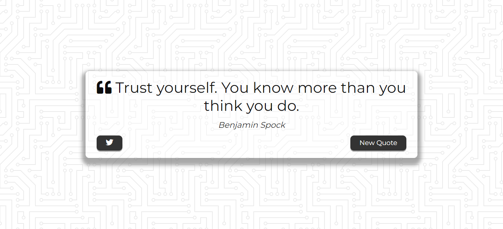

<h2 align="center">
  Quote Generator ⚡
</h2>

  

  <a href="https://quote-generator.vercel.app/">Acesse a página ✨</a>

## :dart: Sobre
Com o Quote Generator, fiz uma requisição API para acessar as citações e coloquei em prática conhecimentos básicos sobre HTML, CSS e JavaScript.  

## 🧬 Linguagens
Este projeto foi desenvolvido utilizando as seguintes linguagens:

- HTML
- CSS
- JavaScript

## :rocket: Autora
 

